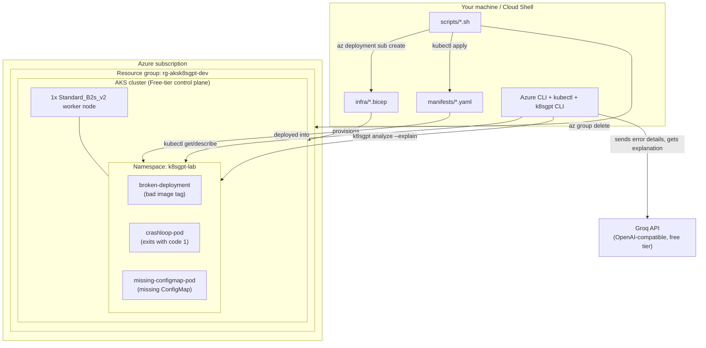

# aks-k8sgpt-diagnostics-lab

Practice project pairing Infrastructure-as-Code (Bicep, from the earlier
project) with an AI-powered Kubernetes diagnostic tool. You'll provision a
minimal AKS cluster, deploy a few intentionally broken workloads, then use
[K8sGPT](https://k8sgpt.ai/docs/getting-started/installation) with a
[Groq](https://console.groq.com/keys) backend (free tier, OpenAI-compatible
API) to get plain-English root-cause explanations for each failure.

## What is this project, in plain English?

Kubernetes failures usually show up as short, cryptic statuses —
`ErrImagePull`, `CrashLoopBackOff`, `CreateContainerConfigError` — and you
normally have to dig through `kubectl describe` output to figure out what
actually went wrong. **K8sGPT** reads that same pod/deployment data and asks
an AI model to explain it in a normal sentence, e.g. *"the container image
tag doesn't exist — check the tag name."*

This lab gives you a real (tiny) AKS cluster, deliberately breaks 3 things
in 3 different ways, and lets you compare your own diagnosis against
K8sGPT's AI explanation — so you can see whether it's actually useful, and
learn to read Kubernetes failures faster either way.

### How it works, step by step

1. **Bicep** (`infra/`) provisions a minimal AKS cluster in Azure — one
   small worker node, free-tier control plane.
2. **Scripts** (`scripts/`) automate the boring parts: deploying the
   cluster, installing K8sGPT, applying the broken workloads, and tearing
   everything down again.
3. **Manifests** (`manifests/`) are 3 Kubernetes YAML files, each broken in
   a different way on purpose (bad image tag, crashing container, missing
   ConfigMap).
4. **K8sGPT** scans the cluster, finds the broken resources, sends their
   error details to Groq's AI model, and prints back a plain-English
   explanation + suggested fix for each one.

## Architecture



Everything under `azure/` is real, billable infrastructure. Everything
under `local/` (scripts, Bicep source, manifests) is just files in this
repo — deleting the repo doesn't delete the cluster, and deleting the
cluster doesn't delete the repo. They're cleaned up separately (see
[Deleting everything](#deleting-everything) below).

## ⚠️ Cost warning — read this first

Unlike the free-tier Bicep project, **this one is not free**:

- The AKS **control plane** uses the `Free` SKU tier — no charge, no SLA.
- The **worker node** is a real VM (`Standard_B2s_v2`, ~$0.02–0.04/hour
  depending on region) and **you pay for it as long as it exists**, even
  if it's just sitting idle overnight.
- `k8sgpt analyze --explain` calls Groq's free-tier API — no cost, but
  free-tier rate limits apply (see your
  [Groq console](https://console.groq.com/settings/limits)).

**Run `scripts/cleanup.sh` every time you're done for the session.** Don't
leave the cluster running between practice sessions.

## Project structure

```
aks-k8sgpt-lab/
├── infra/
│   ├── main.bicep              # subscription-scoped orchestrator
│   └── modules/
│       └── aks.bicep           # single-node, Free-tier AKS cluster
├── manifests/
│   ├── namespace.yaml
│   ├── broken-deployment.yaml  # bad image tag
│   ├── crashloop-pod.yaml      # container exits immediately
│   └── missing-configmap-pod.yaml  # references a ConfigMap that doesn't exist
└── scripts/
    ├── deploy-cluster.sh       # az deployment sub create + get-credentials
    ├── install-k8sgpt.sh       # installs K8sGPT CLI, configures Groq backend
    ├── run-scan.sh             # applies broken manifests, runs k8sgpt analyze
    ├── reset-lab.sh            # deletes just the k8sgpt-lab namespace (keeps the cluster)
    └── cleanup.sh              # deletes the resource group + local kubeconfig entries (stops billing)
```

## Prerequisites

- Azure CLI, logged in (`az login`), Bicep installed (`az bicep install`)
- `kubectl` installed
- A free Groq account with an API key ([console.groq.com/keys](https://console.groq.com/keys))
- Homebrew (recommended) or `kubectl krew`, for installing K8sGPT — if
  neither is available, `install-k8sgpt.sh` falls back to downloading the
  official binary directly (Linux and Windows/Git Bash are both handled)

## Step-by-step commands

```bash
chmod +x scripts/*.sh

# 1. Provision the cluster (~5-10 min) — starts billing on the worker VM
./scripts/deploy-cluster.sh koreacentral

# 2. Confirm the cluster is up
kubectl get nodes

# 3. Install and configure K8sGPT (Groq backend)
export GROQ_API_KEY=gsk_...
./scripts/install-k8sgpt.sh

# 4. Deploy the broken workloads and let K8sGPT explain them
./scripts/run-scan.sh

# or run the analysis manually, any time:
k8sgpt analyze --explain --namespace k8sgpt-lab

# Editing a manifest and want a clean re-run? Reset just the namespace,
# no need to redeploy the whole cluster:
./scripts/reset-lab.sh
./scripts/run-scan.sh

# 5. When you're done for the session — stop billing
./scripts/cleanup.sh rg-aksk8sgpt-dev aks-aksk8sgpt
```

`k8sgpt analyze --explain` will walk each failing resource and produce
something like: *"the deployment's container image tag doesn't exist in
the registry — check the tag name and confirm it's been pushed."* Compare
that explanation against what you already know is wrong in each manifest —
that comparison is the actual learning exercise.

### Other useful commands while working through the lab

```bash
# See raw pod status/events before asking K8sGPT (do this first!)
kubectl get pods -n k8sgpt-lab
kubectl describe pod <pod-name> -n k8sgpt-lab

# Narrow K8sGPT's scan to one resource kind
k8sgpt analyze --explain --filter Pod --namespace k8sgpt-lab
k8sgpt analyze --explain --filter Deployment --namespace k8sgpt-lab

# Switch to a smaller/faster Groq model if you hit rate limits
k8sgpt auth update --backend localai --model llama-3.1-8b-instant \
  --baseurl https://api.groq.com/openai/v1 --password "$GROQ_API_KEY"

# Check what AI backend K8sGPT is currently using
k8sgpt auth list
```

## Errors you may hit, and how to fix them

| Error | What's actually happening | Fix |
|---|---|---|
| `VM size of Standard_B2s is not allowed in your subscription in location '<region>'` | Some subscriptions (free trial, spending-limit) restrict older VM sizes in certain regions. | Pick a size from the allowed list the error prints, e.g. `Standard_B2s_v2` (already the default in this repo). Re-run `deploy-cluster.sh` — it's safe to retry the same deployment. |
| `git pull` fails with "Your local changes to the following files would be overwritten by merge" (on scripts) | Running `chmod +x` locally creates an uncommitted file-mode change that conflicts with incoming updates. | `git stash show -p` to confirm it's just a mode change, then `git stash drop`. Long-term fix: commit the executable bit once (`git add scripts/*.sh && git commit`) so it stops recurring. |
| `bash: ./scripts/xyz.sh: Permission denied` | The script lost its executable bit (e.g. after a fresh clone that didn't have it committed). | `chmod +x scripts/*.sh` |
| `sudo: The "no new privileges" flag is set...` | Azure Cloud Shell (and similar locked-down containers) block `sudo` entirely. | Not your fault — `install-k8sgpt.sh`'s fallback installs to `~/bin` (no root needed), not `/usr/local/bin`. Make sure you're on the current version of the script. |
| `k8sgpt: command not found` right after installing | The install script added `~/bin` to `PATH` for that script's process only, or you added it to `~/.bashrc` but didn't reload the current shell. | `export PATH="$HOME/bin:$PATH"` in your current shell, or open a new terminal. |
| `git commit` fails with "Author identity unknown" | Fresh Cloud Shell session / new machine has no git user configured. | `git config --global user.email "you@example.com"` and `git config --global user.name "Your Name"` |
| `git push` fails with "Invalid username or token. Password authentication is not supported" | GitHub removed password auth for git over HTTPS. | Create a [Personal Access Token](https://github.com/settings/tokens) (scope: `repo`) and paste it as the password when prompted. Consider `git config --global credential.helper store` so you don't retype it every push. |
| `Error: exhausted API quota for AI provider localai: ... 429 Too Many Requests` | Groq's free tier caps tokens-per-minute (12,000 TPM as of writing); scanning several broken resources at once can hit it. | Wait the number of seconds the error tells you and re-run `k8sgpt analyze --explain`, or switch to a smaller/faster model (see `k8sgpt auth update` command above). |
| K8sGPT install script downloads something that doesn't run | Its OS-detection fallback must match your actual shell: Linux (Cloud Shell, WSL, real Linux) downloads `k8sgpt_Linux_<arch>.tar.gz`; Git Bash on Windows downloads `k8sgpt_Windows_x86_64.zip`. | Confirm with `uname -s` — `MINGW*`/`MSYS*` means Git Bash on Windows, anything else Linux-like uses the Linux path. Both are handled in the current `install-k8sgpt.sh`. |
| `nginx:latest` pod doesn't actually fail | `latest` is a real, valid tag, so `broken-deployment.yaml` wouldn't reproduce `ErrImagePull` as intended. | Already fixed in this repo — the manifest uses `nginx:1.0-does-not-exist` instead. |

## Suggested learning path

1. **Read the raw failures first.** Before running K8sGPT, use
   `kubectl describe pod <name> -n k8sgpt-lab` and try to diagnose each
   issue yourself. Then compare your read against K8sGPT's explanation.
2. **Break something new.** Write a 4th broken manifest — a resource
   request higher than the node can schedule, a readiness probe pointing
   at the wrong port, a Service with a mismatched selector — and see if
   K8sGPT catches it.
3. **Try filters.** `k8sgpt analyze --filter Pod` vs `--filter Deployment`
   vs no filter, to see how scope changes results.
4. **Move to the Operator.** Once comfortable with the CLI, install the
   [K8sGPT Operator](https://docs.k8sgpt.ai/getting-started/in-cluster-operator/)
   via Helm for continuous in-cluster monitoring instead of ad-hoc scans:
   ```bash
   helm repo add k8sgpt https://charts.k8sgpt.ai/
   helm repo update
   helm install release k8sgpt/k8sgpt-operator -n k8sgpt-operator-system --create-namespace
   ```
5. **Wire it into CI.** Add a GitHub Actions job that deploys to a
   short-lived cluster, runs `k8sgpt analyze`, and fails the build if any
   `error` severity issues are found — a taste of policy-as-code.
6. **Swap backends.** Try K8sGPT's local/offline model option and compare
   explanation quality and latency against Groq.

## Cleanup checklist

- [ ] `./scripts/cleanup.sh <resource-group-name> <cluster-name>` (deletes
      the Azure resource group and the matching local kubeconfig entries)
- [ ] Confirm in the Azure portal that the resource group is gone
- [ ] Revoke or rotate your Groq API key if it was ever pasted somewhere
      shared (chat, screenshot, ticket, etc.)

Just want to clear the broken workloads without tearing down the whole
cluster (e.g. mid-session, after editing a manifest)? Use
`./scripts/reset-lab.sh` instead — it only deletes the `k8sgpt-lab`
namespace and leaves the cluster running (still billing).

## Deleting everything

There are 4 separate things this lab creates, and cleaning up "all of it"
means undoing each one individually — deleting one does **not** delete
the others.

```bash
# 1. Delete the Azure resource group (stops the VM billing) and the
#    matching local kubeconfig context/cluster/user entries
./scripts/cleanup.sh rg-aksk8sgpt-dev aks-aksk8sgpt

# 2. (Optional) Confirm nothing Azure-side survived
az group exists --name rg-aksk8sgpt-dev   # should print "false"

# 3. (Optional) Remove the k8sgpt CLI binary and its saved config
rm -f ~/bin/k8sgpt ~/bin/k8sgpt.exe
rm -rf ~/.k8sgpt

# 4. (Optional) Remove the GROQ_API_KEY from your current shell session
unset GROQ_API_KEY
# and delete the key itself at https://console.groq.com/keys if you no
# longer need it

# 5. (Optional) Remove this repo from your machine entirely
cd ..
rm -rf Aks-K8gpt-Diagnostics-Lab
```

Step 1 is the one that actually matters for cost — steps 3-5 are just
local housekeeping if you're done with the lab for good, not per-session
cleanup.

## License and security

- Licensed under the [MIT License](LICENSE).
- See [SECURITY.md](SECURITY.md) for how secrets are handled in this lab
  (Groq API key, kubeconfig, GitHub token) and what to do if one leaks.
